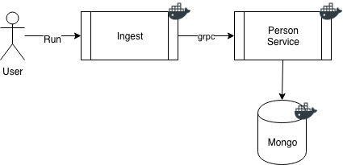

[](https://circleci.com/gh/richardcase/ingest-sample) [](https://coveralls.io/github/richardcase/ingest-sample?branch=master) 

# Ingest Sample

This is a sample that implements an ingest solution. This is proof-of-concept and is not  production ready code (see future areas for improvement below).



## Running Locally

You will need docker and docker-compose to run locally.

Open 2 command windows. In the first run the following:

```bash
docker-compose up person-svc
```
When mongo and the person servive you should see log lines similar to this:

```bash
person-svc_1  | {"component":"person-svc","hostname":"e23d3bd814fb","level":"debug","msg":"database URL is: mongodb://mongo:27017\n","time":"2019-03-03T08:57:59Z"}
person-svc_1  | {"component":"person-svc","hostname":"e23d3bd814fb","level":"info","msg":"started person service","time":"2019-03-03T08:57:59Z"}
```

Then in the second command window run the following command:

```bash
docker-compose up ingest
```

This use the sample data file and call the person service which will save the data in mongo:

```bash
ingest_1      | {"component":"person-svc","hostname":"ecebb6ff200e","level":"info","msg":"starting source worker","time":"2019-03-03T08:58:25Z"}
ingest_1      | {"component":"person-svc","hostname":"ecebb6ff200e","level":"info","msg":"starting workers","time":"2019-03-03T08:58:25Z"}
ingest_1      | {"component":"person-svc","hostname":"ecebb6ff200e","level":"debug","msg":"starting worker 0","time":"2019-03-03T08:58:25Z"}
ingest_1      | {"component":"person-svc","hostname":"ecebb6ff200e","level":"info","msg":"103 people save in 0 seconds","time":"2019-03-03T08:58:25Z"}
ingest-sample_ingest_1 exited with code 0
```

## Omissions & Future Improvement:

To make this production we need to do the following (the list may not be complete):

* [ ] Ingest pipeline needs to handle errors
* [ ] Convert ingest to a service
* [ ] Split the services into their own repos
* [ ] Implement TLS for grpc
* [ ] Additional unit tests - there need to be a bunch more
* [ ] Integration and e2e tests
* [ ] Authentication / Authorization
* [ ] Probes & healthchecks
* [ ] Metrics
* [ ] Kubernetes deployment artefacts (i.e. charts)
* [ ] Skaffold for developing against local Kubernetes
* [ ] Add custom mongo codec to remove raw usage
* [ ] CSV parser assume headers are in the first row

